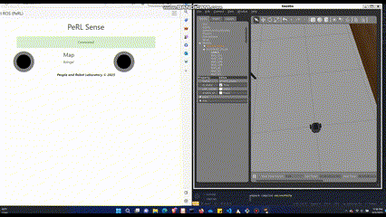

### For your personal use you can tell operate a robot through the following procedure:

## Step 1: Start Rosbridge on Robot
  • Check IP of Robot  
  • Check Rosbridge Port Number  

## Step 2: Make sure both robot and machine are connected on the  same network.
I have used WSL for ROS and a Windows PC for Web Application that was Hosting WSL

(You can skip step 3 Since I have already)
## Step 3: Download ROSLIBJS from the link I have mentioned earlier
  • Put the ROSLIB FIles in the Subdirectory inside the Public folder and Import to your application files and component files  
  
## Step 4: Go to Config.js in scripts folder and put your robot’s IP address and port address

Congratulations! Your ROS TELEOPERATION IS WORKING!
